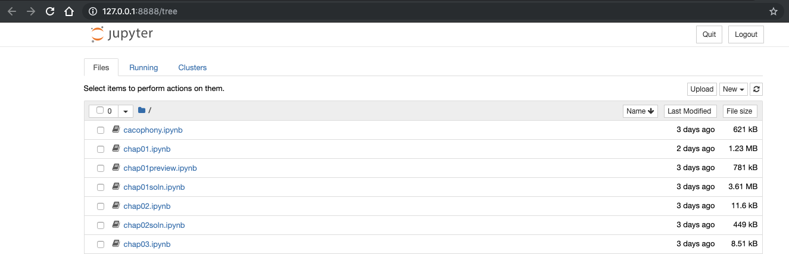
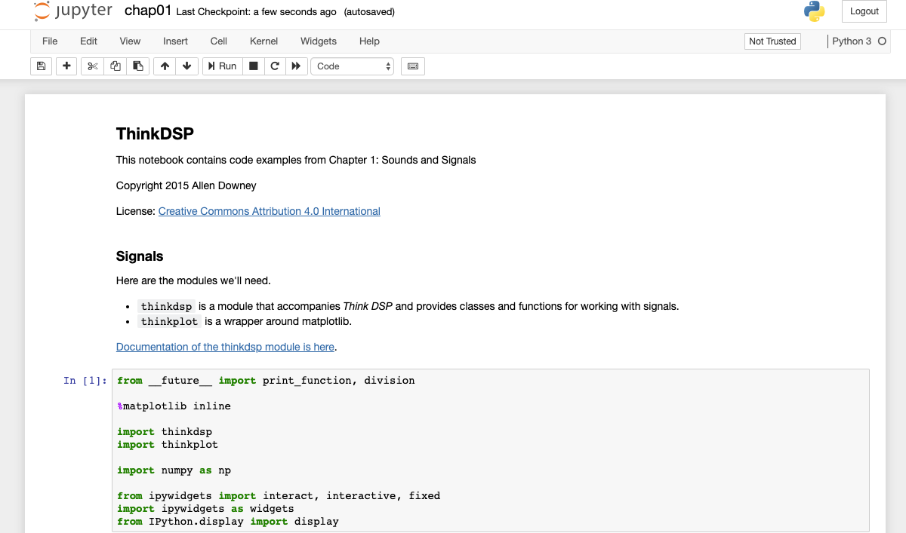
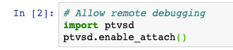
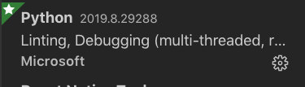
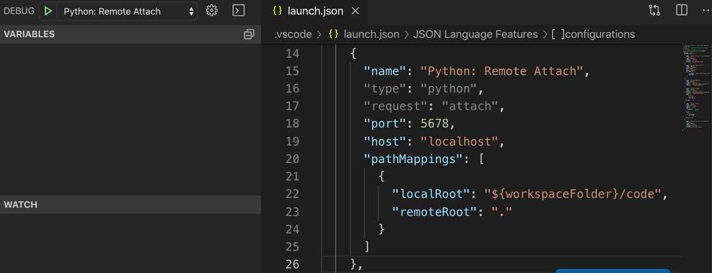
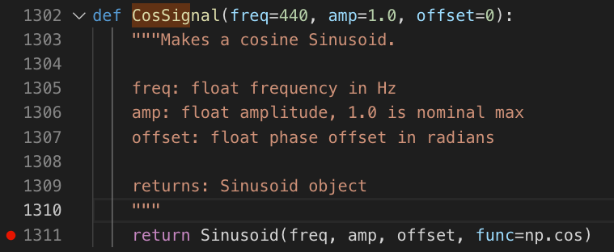
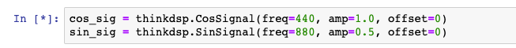
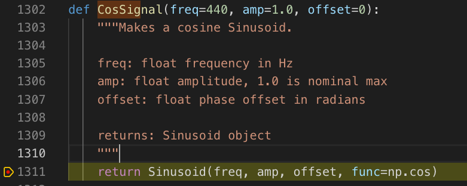
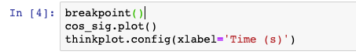
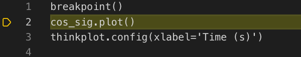

Docker environment for ThinkDSP
========
First, [install Docker](https://www.docker.com/products/docker-desktop).

Setup:

Build the image by adding the dependencies in `environment.yml` to a conda image.
```
> ./dockerbuild.sh
```

Run the image you built. This will start a shell process with access to the `code` directory, and sharing your local machine's ports for the Juypter notebook and Python debugger.
```
> ./dockerrun.sh
```

The image will build and start. Then,

```
(ThinkDSP) root@9d8b4f9dd6f3:/# cd code
(ThinkDSP) root@c5d0c03521d8:/code# ./jupyternotebook.sh
[I 11:57:25.433 NotebookApp] Writing notebook server cookie secret to /root/.local/share/jupyter/runtime/notebook_cookie_secret
[I 11:57:26.042 NotebookApp] Serving notebooks from local directory: /code
[I 11:57:26.042 NotebookApp] The Jupyter Notebook is running at:
[I 11:57:26.042 NotebookApp] http://c5d0c03521d8:8888/?token=127c21da675de60274d6da4d6f0666246b1b0ac3282323dc
[I 11:57:26.042 NotebookApp]  or http://127.0.0.1:8888/?token=127c21da675de60274d6da4d6f0666246b1b0ac3282323dc
[I 11:57:26.042 NotebookApp] Use Control-C to stop this server and shut down all kernels (twice to skip confirmation).
[C 11:57:26.049 NotebookApp] 
    
    To access the notebook, open this file in a browser:
        file:///root/.local/share/jupyter/runtime/nbserver-19-open.html
    Or copy and paste one of these URLs:
        http://c5d0c03521d8:8888/?token=127c21da675de60274d6da4d6f0666246b1b0ac3282323dc
     or http://127.0.0.1:8888/?token=127c21da675de60274d6da4d6f0666246b1b0ac3282323dc
```

Copy that bottom URL (the one with domain `127.0.0.1`) into your web browser.



Select `chap01.ipynb`.



Select `Cells -> Run all` and watch the notebook run! You can make any changes you want.

## Debugging with VS Code

Note that the remote debugging module `ptvsd` is imported.



In [VS Code](https://code.visualstudio.com/), install the Python extension.



On the Debug pane, enable the Python: Remote Attach debug configuration.



Click the  button to attach the debugger. If it succeeds, you'll see a menu like this: 

### Debugging a Python file

To debug a Python file, simply set a breakpoint in VS Code. The notebook mostly uses `thinkdsp.py`, so let's set a breakpoint there. For example, say I want to understand how the `CosSignal()` constructor works. I set a breakpoint in line 1311 of `thinkdsp.py`:



Then I run the cell that invokes it:



Just like that, the debugger stops on the breakpoint:




### Debugging a cell

You can also add a `breakpoint()` statement to a cell then run it to attach the debugger to the cell.





Special thanks to denfromufa for [posting about debugging Jupyter](https://github.com/Microsoft/PTVS/issues/4871)!


